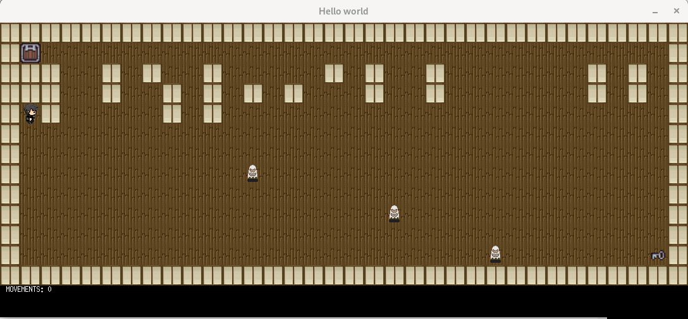

<h1 align="center">
	✏️ So_long
</h1>

## 💡 About the project

> _This project is a very small 2D game._

	Its purpose is to make you work with textures, sprites, and some other very basic gameplay elements..

---

## ⚠️ Requirements

The function is written in C language and thus needs the **`cc` compiler** and some standard **C libraries** to run.

### The Game
* The player’s goal is to collect every collectible present on the map, then escape.
* The up, left, down, and right arrow keys must be used to move the main character.
* The player should be able to move in these 4 directions: up, down, left, right.
* The player should not be able to move into walls.
* At every move, the current number of movements must be displayed in the shell.
* You have to use a 2D view (top-down or profile).
* The game doesn’t have to be real time.
* Although the given examples show a dolphin theme, you can create the world you
want.

### Graphic management
* Your program has to display the image in a window.
* The management of your window must remain smooth (changing to another window, minimizing, and so forth).
* Pressing ESC must close the window and quit the program in a clean way.
* Clicking on the cross on the window’s frame must close the window and quit the
program in a clean way.
* The use of the images of the MiniLibX is mandatory.

### Map
*The map has to be constructed with 3 components: walls, collectibles, and free
space.
* The map can be composed of only these 5 characters:
    * 0 for an empty space,
    * 1 for a wall,
    * C for a collectible,
    * E for a map exit,
    * P for the player’s starting position
* The map must contain 1 exit, at least 1 collectible, and 1 starting position to be valid.
* The map must be rectangular.
* The map must be closed/surrounded by walls. If it’s not, the program must return
an error.
* You have to check if there’s a valid path in the map.
* You must be able to parse any kind of map, as long as it respects the above rules.
* If any misconfiguration of any kind is encountered in the file, the program must exit in a clean way, and return "Error\n" followed by an explicit error message of your choice

### Bonus

* Make the player lose when they touch an enemy patrol
* Add some sprite animation.
* Display the movement count directly on screen instead of writing it in the shell.

### Limitations

* Max 25 lines per function
* Max 5 functions per file
* Max 5 vars per function
* Max 4 arguments
* Only the while loop structure is available
* No external libs or functions allowed, except for malloc and free.

---
## 🛠️ Usage



### Instructions

**1. Compiling the game**

To compile, go to the library path and run:

```shell
$ make
```

**2. Starting the game**

Execute the game file with a path for a valid map

```shell
$ ./game ./maps/v2.ber
```